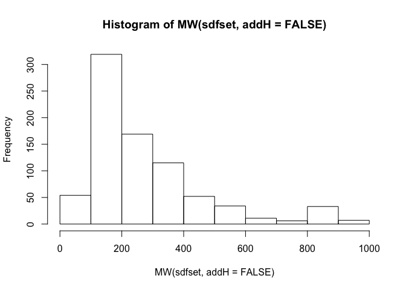
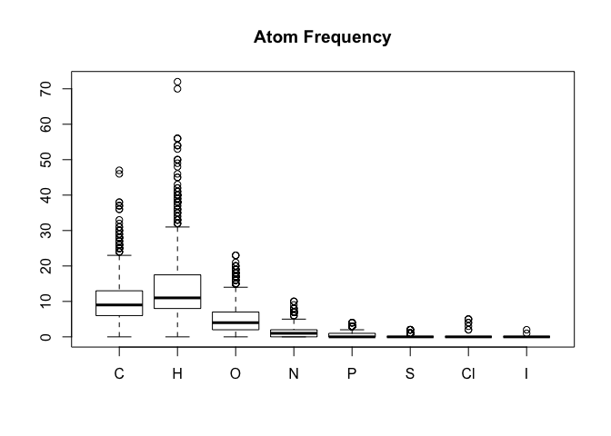
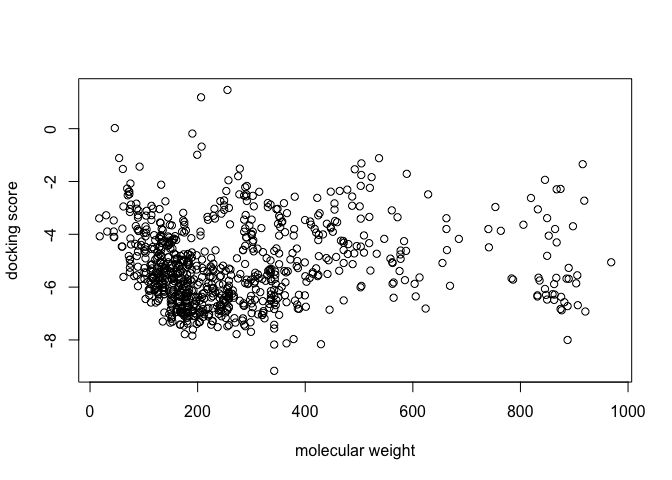
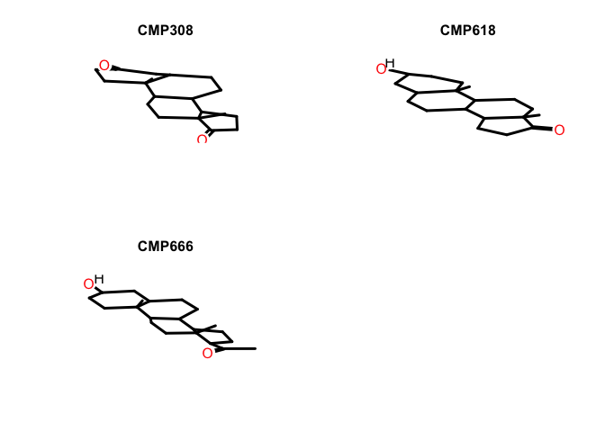
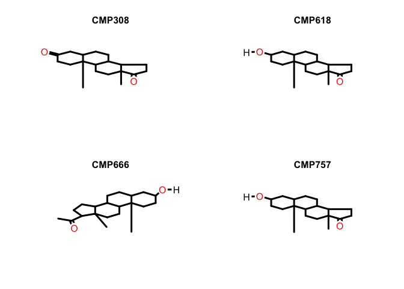
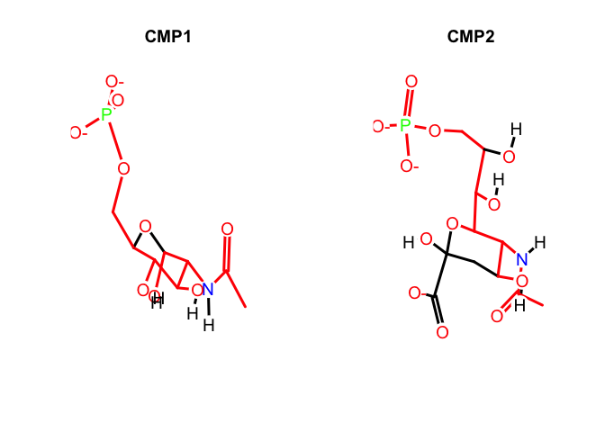
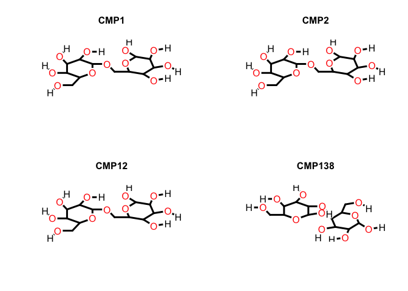

## R Markdown

This is an R Markdown document. Markdown is a simple formatting syntax for authoring HTML, PDF, and MS Word documents. For more details on using R Markdown see <http://rmarkdown.rstudio.com>.

When you click the **Knit** button a document will be generated that includes both content as well as the output of any embedded R code chunks within the document. 

## ChemmineR: Cheminformatics toolkit for R
Documentation for ChemmineR can be found here: 
<https://bioconductor.org/packages/release/bioc/vignettes/ChemmineR/inst/doc/ChemmineR.html>
This practical demonstrates a few basic functions and essentially repeats some of the exercises in the OpenBabel practical.

The directories for this practical are organised as follows:
- src : contains this markdown file
- data: contains any external input files
- output: contains the files written out by this script

### Installation and loading of the package (you only need to install once in a session)

```r
# In the past I managed to run this tutorial without OpenBabel installed 
# on the system. This no longer seems to work. Follow installation 
# instructions here: http://openbabel.org/wiki/Category:Installation
# and then install the ChemmineOB libray to allow access to the openbabel
# functions

# Remove the comments from the next couple of lines to install ChemmineOB and ChemmineR
# if (!requireNamespace("BiocManager", quietly = TRUE))
#    install.packages("BiocManager")
# BiocManager::install("ChemmineOB")
library("ChemmineOB")
# BiocManager::install("ChemmineR")
# Once installed, the package needs to be loaded 
library("ChemmineR")

# To get a list of all functions available, do:
library(help="ChemmineR")

# We will also use the fmcSR package for finding maximum common substructures
# BiocManager::install("fmcsR", version = "3.8")
library("fmcsR")
```

### Format intercoversion and property calculation
First, we will simply transform a SMILES string into an SDFset object and then write that object to a file.


```r
smi_string <- "CCCc1nn(C)c2C(=O)NC(=Nc12)c3cc(ccc3OCC)[S](=O)(=O)N4CCN(C)CC4"
# The format conversion function requires that the vector of smiles has names (otherwise it fails)
names(smi_string) <- c("viagra")
sdf <- smiles2sdf(smi_string)
view(sdf) #check it worked
```

```
## $viagra
## An instance of "SDF"
## 
## <<header>>
##                             Molecule_Name 
##                                  "viagra" 
##                                    Source 
##                  " OpenBabel02182013052D" 
##                                   Comment 
##                                        "" 
##                               Counts_Line 
## " 33 36  0  0  0  0  0  0  0  0999 V2000" 
## 
## <<atomblock>>
##           C1      C2  C3  C5  C6  C7  C8  C9 C10 C11 C12 C13 C14 C15 C16
## C_1  -5.0623 -0.1503   0   0   0   0   0   0   0   0   0   0   0   0   0
## C_2  -6.0134  0.1587   0   0   0   0   0   0   0   0   0   0   0   0   0
## ...      ...     ... ... ... ... ... ... ... ... ... ... ... ... ... ...
## C_32   0.866     1.5   0   0   0   0   0   0   0   0   0   0   0   0   0
## C_33   0.866     0.5   0   0   0   0   0   0   0   0   0   0   0   0   0
## 
## <<bondblock>>
##      C1  C2  C3  C4  C5  C6  C7
## 1     1   2   1   0   0   0   0
## 2     2   3   1   0   0   0   0
## ... ... ... ... ... ... ... ...
## 35   30  32   1   0   0   0   0
## 36   32  33   1   0   0   0   0
## 
## <<datablock>> (0 data items)
## character(0)
```

```r
class(sdf) #sdf is of type SDFset
```

```
## [1] "SDFset"
## attr(,"package")
## [1] "ChemmineR"
```

```r
write.SDF(sdf[[1]], file="output/viagra.sdf") 

# If ChemmineOB has been installed and loaded successfully, many open babel
# functions can be used
# Example 1: generate 3D coordinates
sdf3D = generate3DCoords(sdf)
write.SDF(sdf3D[[1]], file="output/viagra3D.sdf") 
# (if you want to see the result in proper 3D, open it in Chimera)

# Example 2: calculate a small subset of properties
# a description of properties can be found on the open babel website:
# http://openbabel.org/wiki/Obprop
props <- propOB(sdf)
# (the result is a data frame with some basic properties calculated including
# an InChI code and logP)
props$logP
```

```
## [1] 2.5675
```

```r
props$InChI
```

```
## [1] InChI=1S/C22H30N6O4S/c1-5-7-17-19-20(27(4)25-17)22(29)24-21(23-19)16-14-15(8-9-18(16)32-6-2)33(30,31)28-12-10-26(3)11-13-28/h8-9,14H,5-7,10-13H2,1-4H3,(H,23,24,29)
## Levels: InChI=1S/C22H30N6O4S/c1-5-7-17-19-20(27(4)25-17)22(29)24-21(23-19)16-14-15(8-9-18(16)32-6-2)33(30,31)28-12-10-26(3)11-13-28/h8-9,14H,5-7,10-13H2,1-4H3,(H,23,24,29)
```

Next, we will do some basic analysis of the docked poses of ligands that we
used in the open babel tutorial.


```r
# 
# Read in the sdf file with all docked poses into an SDFset type object
# Note: if this file is not in your current working directory, you need
# to provide the full path to it
sdfset <- read.SDFset("data/1equ_ligonly_edited.sdf")

# Check how many SDF objects(molecules) are in this set
length(sdfset)
```

```
## [1] 800
```

```r
# SDF files differ from mol files in that they contain a number of 
# properties encoded with tags at the end of the entry (after the atoms
# and bonds blocks)
# View the first entry (first molecule in the file) and check its class
sdfset[[1]]
```

```
## An instance of "SDF"
## 
## <<header>>
##                             Molecule_Name 
##                                  "C05402" 
##                                    Source 
##                  "                    3D" 
##                                   Comment 
##            " Structure written by MMmdl." 
##                               Counts_Line 
## " 45 46  0  0  1  0            999 V2000" 
## 
## <<atomblock>>
##           C1     C2     C3  C5  C6  C7  C8  C9 C10
## C_1   2.9763 2.1988 2.6778   0   0   2   0   0   0
## O_2   4.2141 1.7033 3.1446   0   0   0   0   0   0
## ...      ...    ...    ... ... ... ... ... ... ...
## H_44  0.5034 8.5831 0.4816   0   0   0   0   0   0
## H_45 -2.0707 7.5381 0.6071   0   0   0   0   0   0
## 
## <<bondblock>>
##      C1  C2  C3  C4  C5  C6
## 1     1   2   1   0   0   0
## 2     1   3   1   0   0   0
## ... ... ... ... ... ... ...
## 45   22  44   1   0   0   0
## 46   23  45   1   0   0   0
## 
## <<datablock>> (35 data items)
## i_ionizer_Ion_state_n       i_ionizer_Tot_Q s_ionizer_Ion_centers 
##                   "0"                   "0"                    "" 
##   s_ionizer_Ion_types                       
##                    ""                 "..."
```

```r
class(sdfset[[1]])
```

```
## [1] "SDF"
## attr(,"package")
## [1] "ChemmineR"
```

```r
# View the properties of the first molecule (this is block 4 in the SDF object)
# these properties were produced by the docking program
sdfset[[1]][[4]]
```

```
##                 i_ionizer_Ion_state_n                       i_ionizer_Tot_Q 
##                                   "0"                                   "0" 
##                 s_ionizer_Ion_centers                   s_ionizer_Ion_types 
##                                    ""                                    "" 
##                 s_ionizer_Ion_ctrs_in          r_ionizer_Ionization_penalty 
##                                    ""                                   "0" 
## r_ionizer_Ionization_penalty_charging  r_ionizer_Ionization_penalty_neutral 
##                                   "0"                                   "0" 
##                      s_st_Chirality_1                      s_st_Chirality_2 
##                        "1_S_2_3_4_24"                        "4_R_8_1_7_25" 
##                      s_st_Chirality_3                      s_st_Chirality_4 
##                       "5_R_2_9_10_26"                       "7_S_12_4_9_29" 
##                      s_st_Chirality_5                      s_st_Chirality_6 
##                       "9_S_13_7_5_31"                     "11_R_16_15_6_34" 
##                      s_st_Chirality_7                      s_st_Chirality_8 
##                    "15_R_18_17_11_38"                    "17_S_21_20_15_39" 
##                      s_st_Chirality_9                     s_st_Chirality_10 
##                    "20_R_23_19_17_42"                    "19_R_16_22_20_41" 
##        i_mmod_Serial_Number-OPLS-2005                      i_i_glide_lignum 
##                                 "686"                                 "679" 
##                     r_i_docking_score                      r_i_glide_gscore 
##                            "-9.17022"                            "-9.17022" 
##                        r_i_glide_lipo                       r_i_glide_hbond 
##                           "-0.943931"                            "-2.53942" 
##                       r_i_glide_metal                       r_i_glide_eburp 
##                                   "0"                            "-1.59468" 
##                        r_i_glide_evdw                       r_i_glide_ecoul 
##                            "-21.9679"                            "-28.0032" 
##                       r_i_glide_erotb                       r_i_glide_esite 
##                            "0.739756"                            "-0.27419" 
##                      r_i_glide_emodel                      r_i_glide_energy 
##                            "-81.3739"                            "-49.9711" 
##                   r_i_glide_einternal                     i_i_glide_confnum 
##                             "12.2605"                                  "10" 
##                     i_i_glide_posenum 
##                                 "757"
```

```r
#the same list of properties can be obtained with a function called datablock:
datablock(sdfset[[1]])
```

```
##                 i_ionizer_Ion_state_n                       i_ionizer_Tot_Q 
##                                   "0"                                   "0" 
##                 s_ionizer_Ion_centers                   s_ionizer_Ion_types 
##                                    ""                                    "" 
##                 s_ionizer_Ion_ctrs_in          r_ionizer_Ionization_penalty 
##                                    ""                                   "0" 
## r_ionizer_Ionization_penalty_charging  r_ionizer_Ionization_penalty_neutral 
##                                   "0"                                   "0" 
##                      s_st_Chirality_1                      s_st_Chirality_2 
##                        "1_S_2_3_4_24"                        "4_R_8_1_7_25" 
##                      s_st_Chirality_3                      s_st_Chirality_4 
##                       "5_R_2_9_10_26"                       "7_S_12_4_9_29" 
##                      s_st_Chirality_5                      s_st_Chirality_6 
##                       "9_S_13_7_5_31"                     "11_R_16_15_6_34" 
##                      s_st_Chirality_7                      s_st_Chirality_8 
##                    "15_R_18_17_11_38"                    "17_S_21_20_15_39" 
##                      s_st_Chirality_9                     s_st_Chirality_10 
##                    "20_R_23_19_17_42"                    "19_R_16_22_20_41" 
##        i_mmod_Serial_Number-OPLS-2005                      i_i_glide_lignum 
##                                 "686"                                 "679" 
##                     r_i_docking_score                      r_i_glide_gscore 
##                            "-9.17022"                            "-9.17022" 
##                        r_i_glide_lipo                       r_i_glide_hbond 
##                           "-0.943931"                            "-2.53942" 
##                       r_i_glide_metal                       r_i_glide_eburp 
##                                   "0"                            "-1.59468" 
##                        r_i_glide_evdw                       r_i_glide_ecoul 
##                            "-21.9679"                            "-28.0032" 
##                       r_i_glide_erotb                       r_i_glide_esite 
##                            "0.739756"                            "-0.27419" 
##                      r_i_glide_emodel                      r_i_glide_energy 
##                            "-81.3739"                            "-49.9711" 
##                   r_i_glide_einternal                     i_i_glide_confnum 
##                             "12.2605"                                  "10" 
##                     i_i_glide_posenum 
##                                 "757"
```

```r
#the data block is a vector of named entries, so each one can be accessed by its name, e.g. to get the glide docking score do:
datablock(sdfset[[1]])["r_i_glide_gscore"]
```

```
## r_i_glide_gscore 
##       "-9.17022"
```

```r
# View the compound ids as stored in the Molecule Name field in the header of the sdf file - below we show the top 5 only (these were compounds from
# KEGG so they all start with "C" and are followed by 5 numbers)
sdfid(sdfset[1:5])
```

```
## [1] "C05402" "C00252" "C05673" "C01103" "C06749"
```

```r
# The function MW calculates molecular weights for the molecules
MW(sdfset[1:5], addH=FALSE)
```

```
##     CMP1     CMP2     CMP3     CMP4     CMP5 
## 342.2965 342.2965 429.2369 365.1670 887.6396
```

```r
# We can calculate the MW for all compounds and plot a histogram of the
#distribution
hist(MW(sdfset, addH=FALSE))
```

<!-- -->

```r
# There are a number of functions to carry out basic calculations on SDFset
# objects. Below, we demonstrate atom counting, followed by visualisation
# of the distribution of different atom types in this set
# The function atomcountMA will return a matrix of the results where the
# the rows are the compounds and columns are the atom types being counted.
propma <- atomcountMA(sdfset, addH=FALSE)
boxplot(propma, main="Atom Frequency")
```

<!-- -->

```r
# Below we will extract the docking score for each compound and check
# whether it correlates with molecular weight (as it often does in docking
# programs)

# The datablock function returns a list of all data blocks and we want
# to extract only the "r_i_docking_score" entry from each data block
# The sapply function will return a vector of the docking scores
ds<- as.numeric(sapply(datablock(sdfset), '[[', "r_i_docking_score"))
# check we got all of them (length should be 800)
length(ds)
```

```
## [1] 800
```

```r
# we can also assign the proper molecule names to this vector
names(ds) <- sdfid(sdfset)
# check it worked
ds[1:3]
```

```
##   C05402   C00252   C05673 
## -9.17022 -8.17455 -8.16124
```

```r
# now we will plot docking scores vs molecular weights
mw <- MW(sdfset, addH=FALSE)
plot(mw, ds, xlab="molecular weight", ylab="docking score")
```

<!-- -->

```r
# do a correlation test
cor.test(mw, ds)  #correlation is marginal and the plot suggests there is no big problem here
```

```
## 
## 	Pearson's product-moment correlation
## 
## data:  mw and ds
## t = 2.0854, df = 798, p-value = 0.03735
## alternative hypothesis: true correlation is not equal to 0
## 95 percent confidence interval:
##  0.004328747 0.142209288
## sample estimates:
##        cor 
## 0.07362082
```

```r
#
```

### Substructure searching
ChemmineR uses the package fmcsR to carry out maximum common substructure
searches. It can also use open babel's functionality to do SMARTS searches.


```r
library(fmcsR) 

# We will look for a steroid skeleton using a SMARTS search
# (you can visualise the SMILES below using an online translator such as:
# http://www.openmolecules.org/name2structure.html )
smi_query <- "C1C2C(CCC1)CCC3C2CCC4C3CCC4"
# Remember: SMILES strings are valid SMARTS patterns
steroids<- smartsSearchOB(sdfset,"C1C2C(CCC1)CCC3C2CCC4C3CCC4")
# you should get back 6 hits
table(steroids)
```

```
## steroids
##   0   1 
## 794   6
```

```r
# check which molecules were found to contain this skeleton
which(steroids == 1)
```

```
## CMP308 CMP618 CMP666 CMP757 CMP763 CMP776 
##    308    618    666    757    763    776
```

```r
# plot the first three answers to check (print=FALSE stops the printing of the SDF containers on the screen so that only the 2D structures and their names are printed)
plot(sdfset[which(steroids == 1)[1:3]], print=FALSE) 

# Now we will carry out a substructure search using fmcsR
# For this, we need the query into sdf format
names(smi_query) <- c("steroid")
sdf_query <- smiles2sdf(smi_query)


# We will use the maximum common substructure search and limit
# the results to cases where the MCS is the same size as the query
# (au=bu=0 means that the upper bound for atom and bond mismatches is zero)
mcs_results <- fmcsBatch(sdf_query[1], sdfset, au=0, bu=0)
# extract molecules where the MCS size is equal to the size of the query
index<- which(mcs_results[,"MCS_Size"] ==17)
hits <- sdfset[index]
length(hits)
```

```
## [1] 6
```

```r
# check the first 4 hits
plot(hits[1:4], regenCoords=TRUE, print=FALSE) # Plots structures to R graphics device
```

<!-- --><!-- -->

```r
# The R graphics representation of these compounds is not that great but hits
# can be visualised instead on the online viewer of Chemmine using
# the following command (which opens on a browser window). 

sdf.visualize(hits)
```

```
## [1] "http://chemmine.ucr.edu/ChemmineR/showJob/139089cf-8f06-44c2-8add-e0ee6654750f"
```

```r
# Finally, we can extract the MCS from a pairwise comparison and visualise it; # we select here two compounds from the sdfset as the result looks better
# the MCS will be coloured red in the molecular diagrams
# You may need to resize the plotting window to see the structures better.
plotMCS(fmcs(sdfset[[10]], sdfset[[100]], au=0, bu=0, matching.mode="aromatic")) 
```

<!-- -->

### Generating and comparing fingerprints
Finally, we will look at fingerprint generation and comparison using ChemmineR

```r
# First, we generate FP2 fingerprints using open babel's functionality
# FP2 are path-based fingeprints
fp2set <- fingerprintOB(sdfset, "FP2")
# check the first two entries
view(fp2set[1:2])
```

```
## $CMP1
## An instance of "FP" of type "unknown-4670"
## <<fingerprint>>
## 0 0 0 0 0 0 0 0 0 0 0 0 0 0 0 0 0 0 0 0 ... length: 1024 
## 
## $CMP2
## An instance of "FP" of type "unknown-5360"
## <<fingerprint>>
## 0 0 0 0 0 0 0 0 0 0 0 0 0 0 0 0 0 0 0 0 ... length: 1024
```

```r
# compare all ligands to the first one (and return only the top 4)
fpSim.out <- fpSim(fp2set[1], fp2set, method="Tanimoto", cutoff=0.4, top=4) 
fpSim.out
```

```
##   CMP1   CMP2  CMP12 CMP138 
##      1      1      1      1
```

```r
# plot the results
plot(sdfset[names(fpSim.out)], regenCoords=TRUE, print=FALSE)
```

<!-- -->

```r
# or for better graphics:
sdf.visualize(sdfset[names(fpSim.out)])
```

```
## [1] "http://chemmine.ucr.edu/ChemmineR/showJob/3850de96-f9b6-44f1-8c55-2eaacf7eaa0c"
```

```r
# Next, we compute a whole matrix of similarities (all against all)
# for the same set of molecules
simMA <- sapply(cid(fp2set), function(x) fpSim(x=fp2set[x], fp2set, sorted=FALSE))
# we can check the similarity value of any two compounds in the matrix
simMA["CMP1", "CMP10"]
```

```
## [1] 0.3135593
```

```r
# or plot the distribuion of all similarity values
dev.off()
```

```
## null device 
##           1
```

```r
hist(simMA)
# We can also use R's clustering functions on the dissimilarity matrix
# below, we do hierarchical clustering using Ward's method agglomeration
hc <- hclust(as.dist(1-simMA), method="ward.D")
plot(as.dendrogram(hc), horiz=FALSE) 
# cut the tree into 10 clusters
groups<-cutree(hc, k=10)
# get the members of one of the clusters
groups[groups == 1]
```

```
##   CMP1   CMP2   CMP8  CMP12  CMP18  CMP41  CMP88  CMP91  CMP93 CMP114 CMP138 
##      1      1      1      1      1      1      1      1      1      1      1 
## CMP139 CMP148 CMP159 CMP186 CMP187 CMP203 CMP229 CMP232 CMP238 CMP256 CMP261 
##      1      1      1      1      1      1      1      1      1      1      1 
## CMP277 CMP282 CMP300 CMP384 CMP390 CMP439 CMP453 CMP551 CMP792 
##      1      1      1      1      1      1      1      1      1
```

```r
# plot the structures of 4 compounds from clusters 2 and 3
plot(sdfset[names(groups[groups==2])[1:4]], regenCoords=TRUE, print=FALSE)
plot(sdfset[names(groups[groups==3])[1:4]], regenCoords=TRUE, print=FALSE)
# or visualising them online:
sdf.visualize(sdfset[names(groups[groups==2])[1:4]])
```

```
## [1] "http://chemmine.ucr.edu/ChemmineR/showJob/26871416-2a2e-4fc5-a922-a44f086dccaf"
```

```r
sdf.visualize(sdfset[names(groups[groups==3])[1:4]])
```

```
## [1] "http://chemmine.ucr.edu/ChemmineR/showJob/de13b172-ce61-4ea0-8169-1a8f9b239c1d"
```

